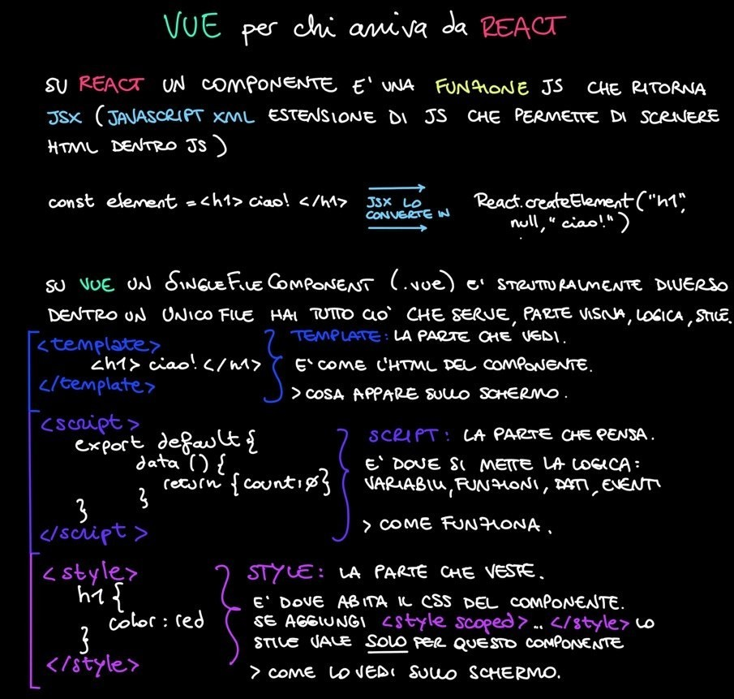
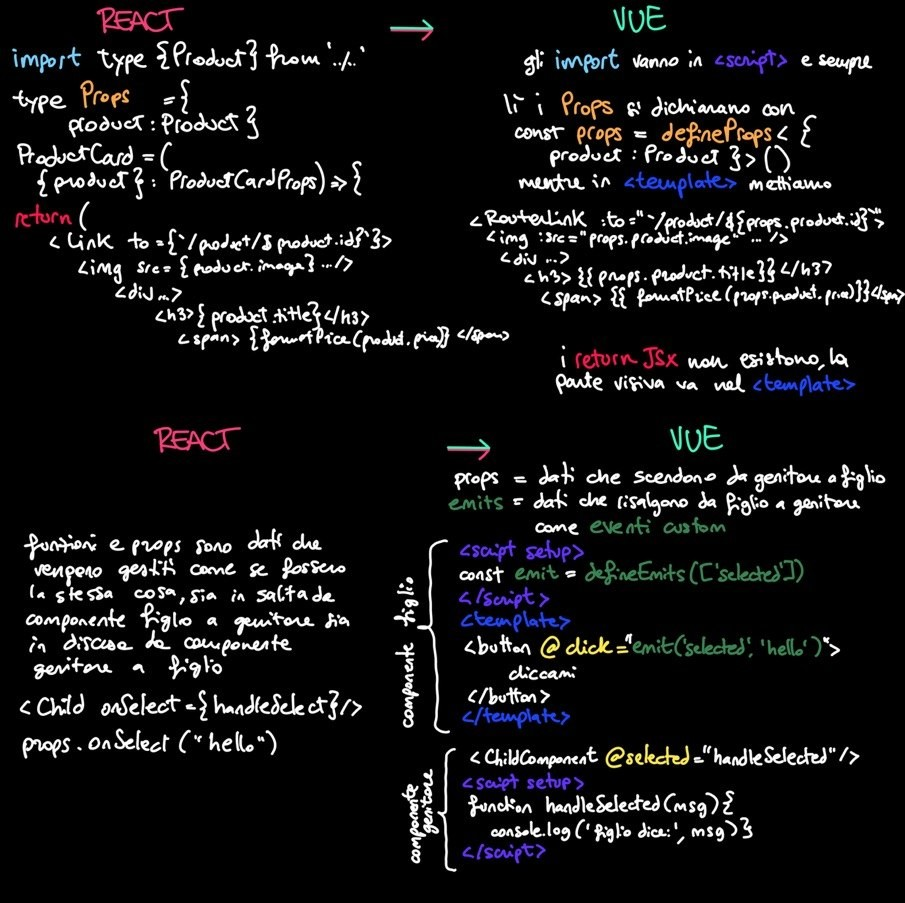

# Ecommerce-store-vue

Questa repo è nata come studio autonomo, dopo la consegna del tech test ecommerce-qubica-store in React, inviata il 19 luglio 2026: avendo quella base da cui iniziare, ho creato questa repo per imparare un framework che non avevo ancora mai usato prima: Vue. 

Questo port raggiunge gli stessi acceptance criteria e bonus del lavoro in React:
- layout con Header e Main
- categorie fetchate dinamicamente dall'API
- griglia prodotti con filtro per categoria chiamato lato API
  (/products/category/{categoria}), non filtrato lato client
- filtro sincronizzato con la query string: deep link e refresh inizializzano correttamente l'interfaccia
- vista dettaglio prodotto con nome, immagine, prezzo e descrizione completa
- stati distinti di caricamento, errore e risultato vuoto
- skeleton loader durante le chiamate
- tema chiaro/scuro
- design system su CSS custom properties, riportato dal progetto React
- unit test su formatPrice con Vitest
- workflow a branch con Pull Request verso main

Non sono ancora coperti: carrello e login, la gestione visuale degli errori, e il deploy (assenti, tranne il deploy, anche nella consegna React, non erano Acceptance Criteria e ho preferito concentrarmi su altri bonus)

L'analisi, le decisioni e le scelte di design system e di accessibilità sono documentate nel Readme della repository [ecommerce-qubica-store](https://github.com/roxyle/ecommerce-qubica-store) (il tech test in React). Consiglio di leggere prima quel readme e poi tornare qui.

## Setup
 
Richiede Node.js 20 o superiore.
 
```sh
git clone https://github.com/roxyle/ecommerce-store-vue.git
cd ecommerce-store-vue
npm install
npm run dev
```
 
L'applicazione parte su `http://localhost:5173`.
 
Altri comandi:
 
```sh
npm run build       # build di produzione
npm run test:unit   # unit test con Vitest
npm run lint        # ESLint e oxlint
npm run type-check  # controllo dei tipi con vue-tsc
```
 
## Stack
 
Vue 3 (Composition API con `script setup`), TypeScript, Vue Router, Vite,
Vitest, CSS Modules con custom properties. Backend: [Fake Store
API](https://fakestoreapi.com/docs).


## Cosa ho imparato dal port

Al di là del doversi abituare a separare il codice nei tre tag strutturali di Vue (script, template e style) e delle traduzioni di sintassi (ref, watch, v-for, v-if, v-else-if, v-else, etc), che sicuramente hanno bisogno di allenamento per venire naturali, **quello che non dipendeva dal framework è stato spostato senza troppe modifiche:**
types, api e utils, essendo in TypeScript puro, sono passati senza una riga di differenza perchè non c'era niente da tradurre. Anche variables.css è passato quasi uguale, ho solo accorpato dentro di lui il reset globale (box-sizing, margin: 0, gli stili di body) che in React stava in index.css.
**Lo stesso trasporto in Vue ha funzionato come una verifica**: se la chiamata all'API e la formattazione dei prezzi fossero state scritte dentro i componenti, avrei dovuto riscriverle di conseguenza. Stando fuori, sono sopravvissute senza modifiche al cambio di framework.

**Lo stesso problema, due soluzioni:**
in React il reset dello stato al cambio prodotto (segnalato da ESLint) è stato risolto rimontando il componente tramite key, in Vue con un watch sul parametro di rotta. In questo caso ho finito per usarli entrambi: la key sul RouterView in App.vue e un watch in ProductDetailView, quindi si sovrappongono (con la key il componente viene comunque ricreato, e il watch funziona di fatto come un onMounted). Ho deciso di lasciarlo documentato invece di correggerlo, perchè è il tipo di ridondanza che nasce portando codice su un framework nuovo, e sono certa che mi sarà utile rivederlo in questa repo fintanto che sarò in fase di studio.

---

### Alcuni appunti

Alcuni appunti presi durante il port, mentre traducevo i concetti da un framework all'altro. Li includo perchè siano un mini scorcio di come lavora la mia testa in fase di learning





